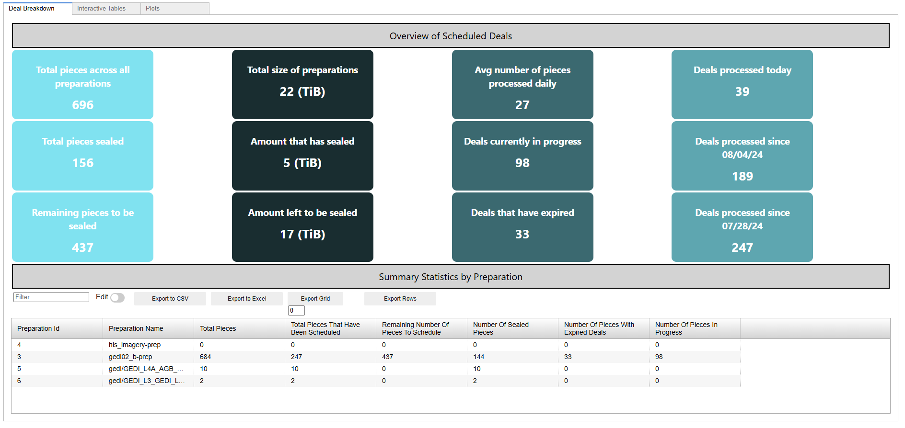

# Tracking the status of onboarding data from Singularity

This notebook serves as a tool for stakeholders to monitor and analyze the progress of onboarding datasets using [Singularity](https://data-programs.gitbook.io/singularity) to Filecoin storage providers. Focus on the deal-making progress to aid in decision-making and operational improvements. It utilizes a variety of Python libraries such as pandas for data manipulation, requests for making HTTP requests, matplotlib and seaborn for plotting, and ipywidgets for creating interactive UI elements within the notebook.



## Getting Started

This project relies on [Poetry] (https://python-poetry.org/) for dependency management. To install, run the following command:

```bash
poetry install --no-root
```

If you don't have Poetry installed, you can follow the instructions [here](https://python-poetry.org/docs/). Otherwise, the included `requirements.txt` file can be used to install the dependencies using pip.

```bash
pip install -r requirements.txt
```

This will install all the required dependencies for the project. To run the notebook, execute the following command:

```bash
poetry run jupyter-notebook
```

This will start a Jupyter notebook server where you can open the `tracking_onboarding_data.ipynb` notebook at the root of the repo. Run All cells to fetch the latest data from our Singularity API endpoint to visualize the status of onboarding data.

Note: Check out the [included flowchart](docs/Overview%20of%20API%20calls.md) to understand the data ingestion pipeline.

## Additional Information

#### Users can track the status of onboarding data to Filecoin by:

- **Running the notebook**: Execute the cells in sequence to fetch the latest data, process it, and generate up-to-date visualizations.
- **Understand your current work**: The provided interactive table to filter and drill down into specific aspects of the data, such as focusing on particular preparations or deal states.
- **Track Performance**: Study the generated plots to identify trends, patterns, and outliers in the onboarding process. This can help in understanding the efficiency of data onboarding, identifying bottlenecks, and tracking the progress of deals.

#### Quick overview of the functionalities and how users can track the status of onboarding data:

1. **Data Retrieval**: The notebook makes HTTP GET and POST requests to a specified API (BASE_URL) to fetch data related to preparations and deals. This includes information about the pieces in each preparation and the status of deals.
2. **Visualization**: The notebook uses matplotlib and seaborn to create various plots and visualizations. These visualizations help in understanding the distribution and status of preparations and deals. For example, it can show the number of pieces in each preparation, the state of deals, and trends over time.
3. **Interactive Widgets**: Through ipywidgets, the notebook provides interactive tables, allowing users to dynamically filter and view the data. This interactivity enhances the user experience by enabling real-time data exploration.
4. **Custom Styling**: It applies custom styling to plots and interactive tables to improve readability and aesthetics..
5. **Utility Functions**: The notebook includes several utility functions for making HTTP requests, processing data, and creating styled HTML widgets. These functions streamline the workflow and can be reused for different datasets or analyses.
