# API Preparation Flowchart

```mermaid
flowchart TD

%% Nodes
    A["Start"]
    B["Make GET request to /api/preparation to get list of all preparations"]
    C["Extract preparation IDs from response"]
    J["Capture the following properties from response:
    - attachmentId
    - storageId
    - source
    - pieces"]
    D{"Are there more preparation IDs?"}
    E["Make GET request to /api/preparation/<prep id>/piece"]
    F["Store/Process the pieces data"]
    I["Capture properties from request:
    - attachmentId
    - storageId
    - source
    - pieces"]
    K["Make POST request to /api/deal to get deal status for preparation"]
    L["Capture the following properties from response:
    - dealId
    - state
    - provider
    - proposalId
    - label
    - pieceCid
    - pieceSize
    - startEpoch
    - endEpoch
    - price
    - verified"]
    M["Aggregate and group pieces by state"]
    N["Identify preparations apart of scheduled deals"]
    O["Identify pieces from a preparation that are part of a scheduled deal"]
    P["Identify pieces for each preparation remaining to be scheduled"]
    G["Move to next preparation ID"]
    H["End"]

%% Connections
    A --> B --> C --> J --> D
    D -- Yes --> E --> F --> I --> K --> L --> M --> N --> O --> P --> G --> D
    D -- No --> H

%% Node styling
    style A color:#FFFFFF, fill:#4CAF50, stroke:#4CAF50
    style B color:#FFFFFF, fill:#FF9800, stroke:#FF9800
    style C color:#FFFFFF, fill:#F44336, stroke:#F44336
    style J color:#FFFFFF, fill:#FFA07A, stroke:#FFA07A
    style D color:#FFFFFF, fill:#2196F3, stroke:#2196F3
    style E color:#FFFFFF, fill:#FFC107, stroke:#FFC107
    style F color:#FFFFFF, fill:#9C27B0, stroke:#9C27B0
    style I color:#FFFFFF, fill:#FF5722, stroke:#FF5722
    style K color:#FFFFFF, fill:#795548, stroke:#795548
    style L color:#FFFFFF, fill:#CDDC39, stroke:#CDDC39
    style M color:#FFFFFF, fill:#1E90FF, stroke:#1E90FF
    style N color:#FFFFFF, fill:#32CD32, stroke:#32CD32
    style O color:#FFFFFF, fill:#FF4500, stroke:#FF4500
    style P color:#FFFFFF, fill:#FFD700, stroke:#FFD700
    style G color:#FFFFFF, fill:#00BCD4, stroke:#00BCD4
    style H color:#FFFFFF, fill:#8BC34A, stroke:#8BC34A
```

This flowchart describes the process of making a GET request to `/api/preparation` to get a list of all preparations, extracting preparation IDs from the response, making a GET request to `/api/preparation/<prep id>/piece`, storing/processing the pieces data, making a POST request to `/api/deal` to get deal status for preparation, aggregating and grouping pieces by state, identifying preparations apart of scheduled deals, identifying pieces from a preparation that are part of a scheduled deal, and identifying pieces for each preparation remaining to be scheduled.

